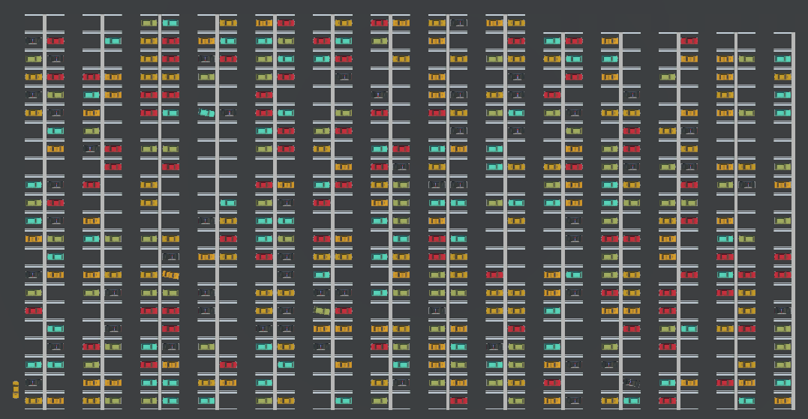

<h1 align="center">Welcome to Parking @ Gent 👋</h1>
<p>
  
  <a href="https://opensource.org/licenses/MIT" target="_blank">
    
  </a>
</p>

> Ever wanted to see the capacity of the car parks in Ghent visualised in unity? Wel now you can!

### 🏠 [Homepage](https://parkerengent.netlify.app/)


## Install

```sh
npm install
```

## Usage

```sh
npm run build
```

## Author

👤 **Sander Spaas**

* Github: [@SanderSpaas](https://github.com/SanderSpaas)
* Gitlab: [@SanderSpaas](https://gitlab.com/sander.spaas)
* Email: sander.spaas@student.odisee.be
## Show your support

Give a ⭐️ if this project helped you!

## 📝 License

Copyright © 2022 [Sander Spaas](https://github.com/SanderSpaas).<br />
This project is [MIT](https://opensource.org/licenses/MIT) licensed.

***
_This README was generated with ❤️ by [readme-md-generator](https://github.com/kefranabg/readme-md-generator)_
